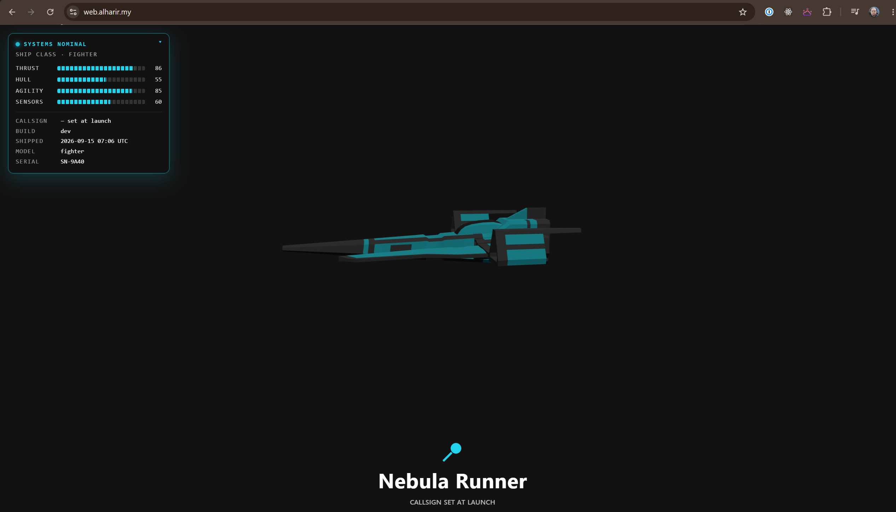

# devops-bootcamp-project

Infrastructure-as-code and configuration-management setup for a small AWS-hosted web
application, built as part of the Infratify DevOps bootcamp.

**GH Pages** : [https://document.alharir.my/](https://document.alharir.my/)

**Live site:** the webserver domain is mapped to [http://web.alharir.my/](http://web.alharir.my/)

**Monitoring page:** the monitoring server is mapped to [http://monitoring.alharir.my/](http://monitoring.alharir.my/)



## Overview

- **`terraform/`** — provisions the AWS infrastructure: a VPC with public/private subnets,
  a `webserver` EC2 instance (public subnet, Elastic IP), a `controller` instance (private
  subnet, runs Ansible), and a `monitor` instance (private subnet, runs Prometheus).
- **`ansible/`** — configures the provisioned instances:
  - `playbook-webserver.yaml` — installs Docker/AWS CLI and deploys the app container
    (pulled from ECR) to the `webserver` host.
  - `playbook-exporter.yaml` — installs `node_exporter` on the `webserver` host.
  - `playbook-prometheus.yaml` — installs Prometheus on the `monitor` host.
- **`app/`** — the application itself: a Three.js "ship microsite" built with Vite,
  containerized via its `Dockerfile`. See [app/README.md](app/README.md) for app-specific
  usage.

## Architecture

```
                                   Internet
                                      │
                                web.haririabd.my
                                      │
                              ┌───────▼────────┐
                    Public    │   webserver     │  (Elastic IP, Docker app on :80)
                    subnet    └───────┬────────┘
                                      │
                              ┌───────▼────────┐
                    Private   │   controller    │  (runs Ansible against the fleet)
                    subnet    ├────────────────┤
                              │    monitor      │  (Prometheus, scrapes node_exporter)
                              └────────────────┘
```

## Usage

Provision infrastructure:

```bash
cd terraform
terraform init
terraform apply
```

Configure the hosts (from the `controller` instance, or wherever the inventory is reachable):

```bash
cd ansible
ansible-galaxy install -r requirements.yaml
ansible-playbook -i inventory/inventory.ini playbooks/playbook-webserver.yaml
ansible-playbook -i inventory/inventory.ini playbooks/playbook-exporter.yaml
ansible-playbook -i inventory/inventory.ini playbooks/playbook-prometheus.yaml
```
